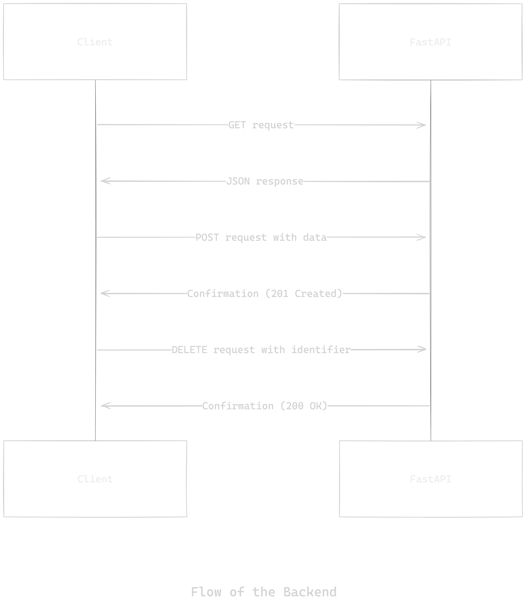

# CRUD FastAPI Student Management System

## Overview
This project is a simple CRUD (Create, Read, Update, Delete) application for managing student records, built using FastAPI. The application allows you to add, retrieve, update, and delete student records, and persists data in a JSON file.
 
Here's the Flow of the Project:



## Installation

### Prerequisites

- Python 3.7+
- FastAPI
- uvicorn

## Setup

**Clone the repository**:
   ```bash
   git clone <repository_url>
   cd <repository_directory>
   ```

**Create a virtual environment**:
   ```bash
   python -m venv venv
   source venv/bin/activate  # On Windows use `venv\Scripts\activate`
   ```

 **Install the dependencies**:
   ```bash
   pip install fastapi uvicorn pydantic
   ```

## Running the Application

 **Start the FastAPI server**:
   ```bash
   uvicorn app:app --reload
   ```

**Access the API documentation**:
   Open your web browser and navigate to `http://127.0.0.1:8000/docs` to see the interactive API documentation provided by Swagger UI.

## API Endpoints

### Root Endpoint

- **`GET /`**: Returns a welcome message.
  ```json
  {
    "Hello From Question 1": "Welcome to Student Management System Designed Using FastAPI"
  }
  ```

### Students Endpoints

- **`GET /students/`**: Retrieves all student records.
  - Response: List of student records.

- **`GET /student/{roll_no}`**: Retrieves a student record by roll number.
  - Response: Student record with the specified roll number.
  - Error: 404 if the student record is not found.

- **`POST /insert_student_data/`**: Inserts a new student record.
  - Request Body: Student data (roll_no, name, year, branch).
  - Response: The inserted student record.

- **`POST /insert_students_data/`**: Inserts multiple new student records.
  - Request Body: List of student data.
  - Response: List of inserted student records.

- **`PUT /update_student_data/`**: Updates an existing student record.
  - Request Body: Updated student data (must include roll_no).
  - Response: The updated student record.
  - Error: 404 if the student record is not found.

- **`DELETE /delete_student/{roll_no}`**: Deletes a student record by roll number.
  - Response: Message indicating the student record was deleted.
  - Error: 404 if the student record is not found.

- **`DELETE /delete_student/{name}`**: Deletes student records by name.
  - Note: This endpoint can delete multiple records if students share the same name.
  - Response: Message indicating the student record was deleted.
  - Error: 404 if the student record is not found.

## Data Persistence

- The student records are stored in a JSON file (`students.json`). The data is loaded from this file on startup and saved to this file whenever a change is made.

## Project Structure

- **app.py**: Main FastAPI application file.
- **students.json**: JSON file for persisting student data.

## Usage

**Adding Student Records**:
   Use the `/insert_student_data/` or `/insert_students_data/` endpoints to add new student records.

**Retrieving Student Records**:
   Use the `/students/` or `/student/{roll_no}` endpoints to retrieve student records.

**Updating Student Records**:
   Use the `/update_student_data/` endpoint to update an existing student record.

**Deleting Student Records**:
   Use the `/delete_student/{roll_no}` or `/delete_student/{name}` endpoints to delete student records.

