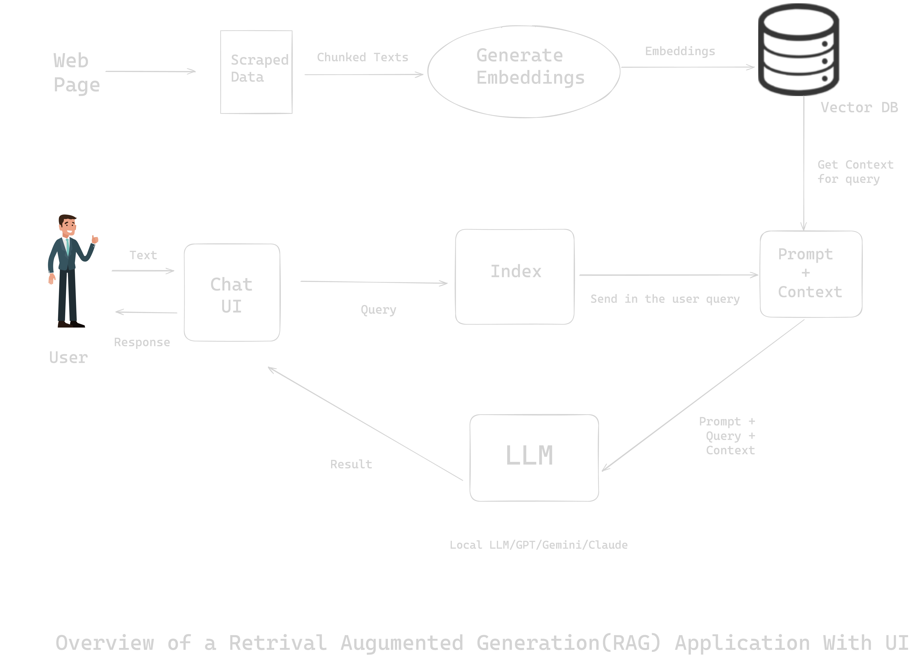

# Streamlit UI for RAG based LLM Chat Application

## Overview
This project aims to design an User Interface(UI) for the REST API Calling to a Retrieval-Augmented Generation Application or any LLM API.

Below is a flowchart depicting the overall process of the project:



## Folder Structure and File Descriptions
### Main Directory

- **chat_ui_simple.py**: The file that initializes the ui of the chat application.
- **chat_ui_with_speech.py**: Similar to the above file with additional features like `speech` input and  `text to speech` output.
- **requirements.txt**: A file listing all the Python dependencies required to run the project.


### Hidden and Virtual Environment Directories

- **.gitignore**: Specifies files and directories to be ignored by git.
- **.venv/**: Directory for the virtual environment used for the project.

## Getting Started

### Prerequisites

Ensure you have Python installed.

Setup a venv and activate it.

You can install the necessary dependencies using:

```bash
pip install -r requirements.txt
```

### Starting the App Server
To run the streamlit app:
-  Run the `chat_ui_simple.py` or  `chat_ui_with_speech.py` using the command 
```python 
streamlit run chat_ui_simple.py

``` 
```python 
streamlit run chat_ui_with_speech.py

```
### Serving Requests 
To make a post request:
- Make a post request to your url in `requests.post('YOUR_URL')` as:
```Python
response = requests.post("YOUR_ENDPOINT_URL", json={"YOUR_JSON_DATA"})
```
